# ⚡ AURA STUDIO - Website Thương Mại Điện Tử Thời Trang Fullstack

> **Hệ thống website thương mại điện tử chuyên về thời trang Streetwear & Unisex cao cấp.**
> Dự án được xây dựng với kiến trúc Fullstack hiện đại: **Frontend React 19 (Vite)** mang phong cách Dark/Cyberpunk Glassmorphism mượt mà, **Backend Node.js & Express RESTful API**, kết nối trực tiếp **Cloud Database MongoDB Atlas** (100% dữ liệu thực tế), tích hợp cổng thanh toán **MoMo & VNPay Sandbox**, hệ thống **Hỗ Trợ & Live Chat CSKH**, **Cổng Khách Hàng (Customer Portal)** toàn diện 7 phân hệ và **Trang Quản Trị Hệ Thống (Admin Portal - `/admin`)** chuyên sâu.

[](https://nodejs.org/)
[](https://react.dev/)
[](https://vitejs.dev/)
[](https://www.mongodb.com/)
[](https://jwt.io/)
[](https://github.com/Hoangphuc187/aura-fashion-ecommerce)

---

## 📸 GIAO DIỆN HỆ THỐNG THỰC TẾ 

Toàn bộ hình ảnh dưới đây được chụp trực tiếp từ hệ thống đang chạy thời gian thực với cơ sở dữ liệu MongoDB Atlas thực tế:

### 🌟 PHẦN 1: TRẢI NGHIỆM KHÁCH HÀNG & MUA SẮM (STOREFRONT)

#### 1. Trang Chủ AURA STUDIO — Hero Banner & Flash Sale Đếm Ngược
*Giao diện Dark Mode chuẩn editorial, tích hợp thanh thông báo ưu đãi động, đồng hồ đếm ngược Flash Sale theo thời gian thực và các bộ sưu tập theo mùa.*
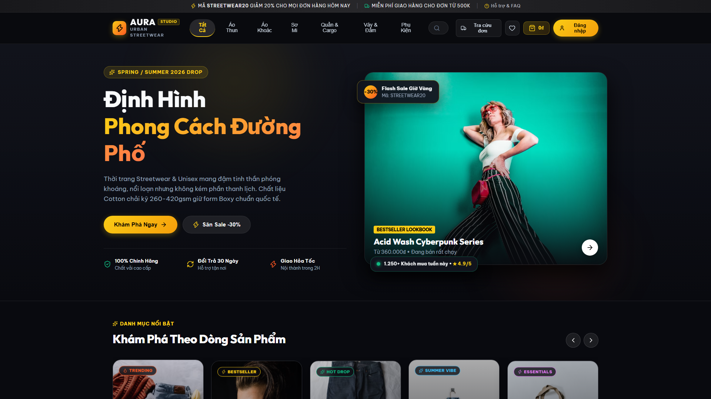

---

#### 2. Danh Mục Sản Phẩm & Bộ Lọc Thông Minh (Filters & Search)
*Bộ lọc đa tiêu chí: Lọc theo 6 danh mục thời trang, chọn kích cỡ (S, M, L, XL, XXL), thanh kéo khoảng giá linh hoạt và tìm kiếm gợi ý tức thì.*
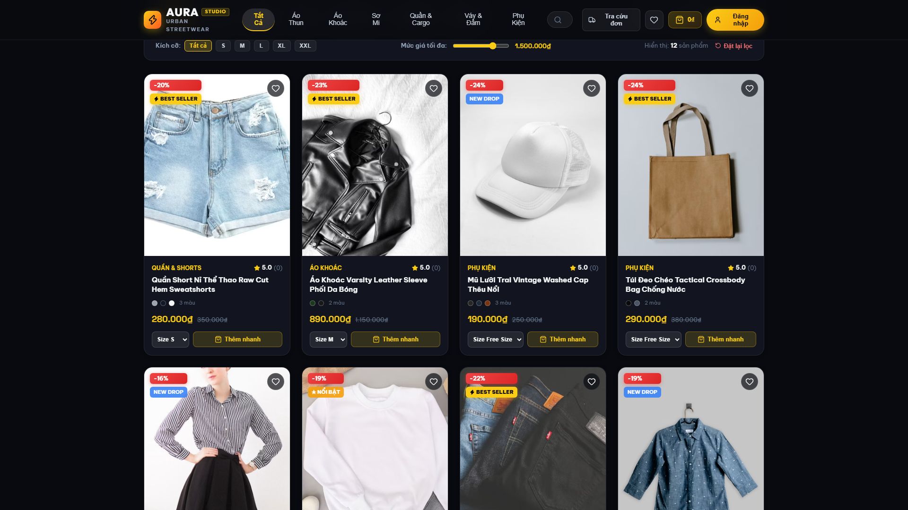

---

#### 3. Modal Chi Tiết Sản Phẩm & Bảng Size Chuẩn Streetwear
*Thư viện hình ảnh sắc nét, hiển thị huy hiệu Best Seller, chọn màu sắc trực quan (Color Swatches), bảng quy đổi kích cỡ chi tiết và danh sách đánh giá từ người mua.*
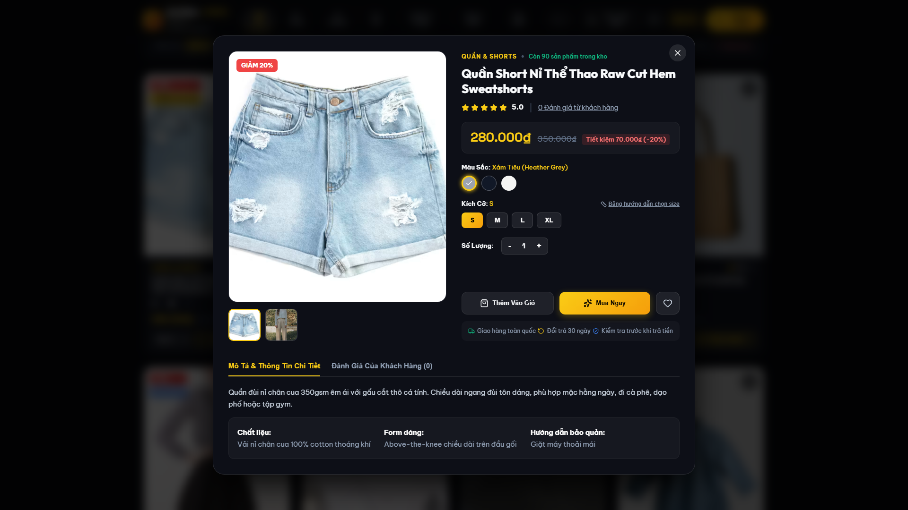

---

#### 4. Giỏ Hàng Trượt (Cart Drawer) & Thanh Tiến Trình Freeship
*Thanh trượt từ cạnh phải mượt mà, tính toán tạm tính và phí vận chuyển tự động, thanh tiến trình đạt mốc miễn phí giao hàng (Free Shipping Progress Bar) và áp dụng voucher.*
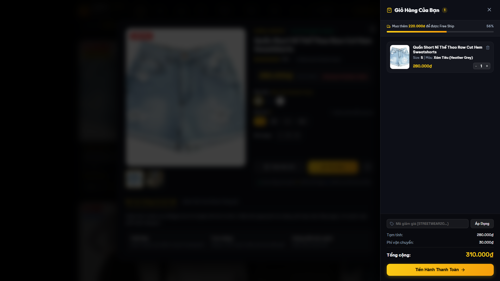

---

#### 5. Quy Trình Đặt Hàng & Thanh Toán (Checkout Modal)
*Tự động lấy thông tin từ Sổ địa chỉ mặc định của khách hàng, tích hợp lựa chọn phương thức thanh toán linh hoạt: COD, Ví MoMo QR/ATM và Cổng VNPay.*
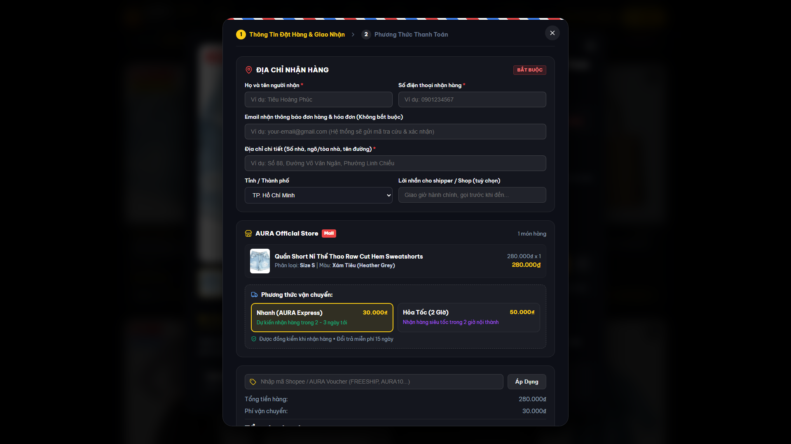

---

#### 6. Tra Cứu Tiến Độ Vận Đơn Thời Gian Thực (Order Tracking)
*Khách hàng nhập mã đơn hàng bất kỳ để theo dõi timeline 4 bước giao vận (Chờ xác nhận ➔ Đang xử lý ➔ Đang giao ➔ Giao thành công) kèm thông tin shipper và mã QR tra cứu.*
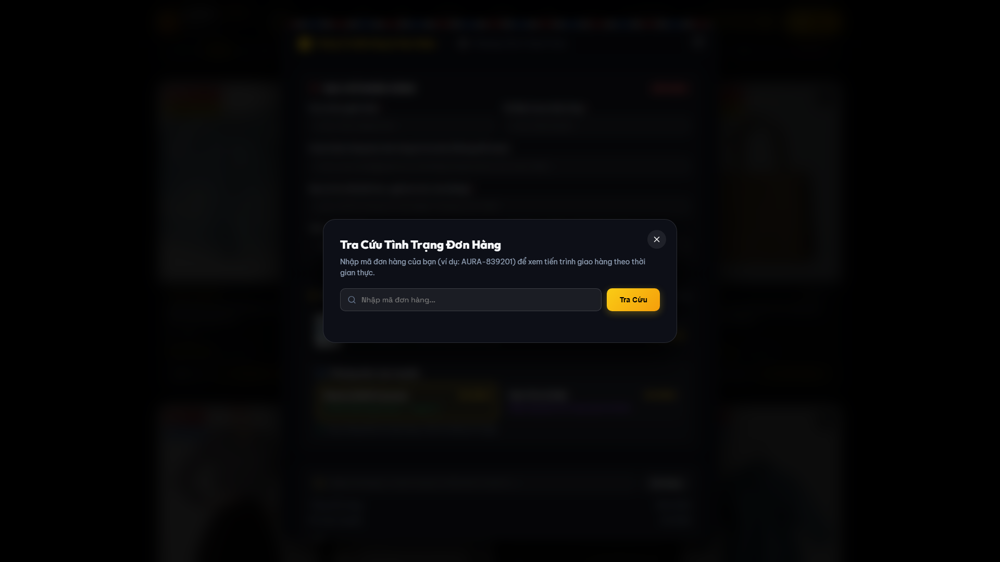

---

#### 7. Cổng Hỗ Trợ Khách Hàng — Câu Hỏi Thường Gặp (FAQ Accordion)
*Hệ thống giải đáp chi tiết các thắc mắc về chính sách đổi trả 30 ngày, hoàn tiền, đồng kiểm khi nhận hàng, hướng dẫn chọn size và bảo hành.*
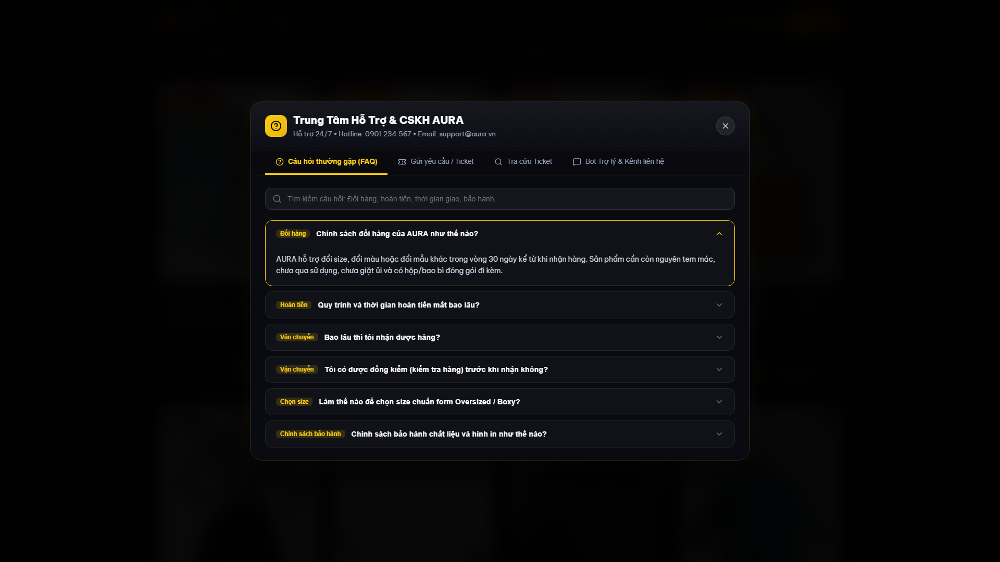

---

#### 8. Gửi Yêu Cầu Hỗ Trợ & Tạo Vé Hỗ Trợ (Ticket CSKH)
*Khách hàng gửi yêu cầu hỗ trợ khi gặp vấn đề về đơn hàng, tự động cấp mã Ticket dạng `#TK-XXXXXX` lưu trực tiếp vào cơ sở dữ liệu.*
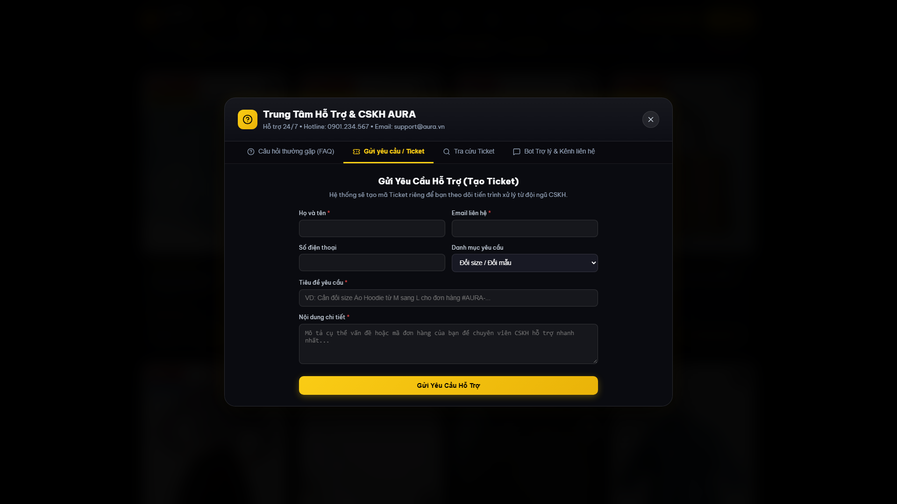

---

#### 9. Trợ Lý Tư Vấn Ảo AI Tự Động 24/7 (Live Chat Assistant)
*Chatbot tương tác thông minh giải đáp ngay lập tức về tư vấn chọn size theo chiều cao/cân nặng, tra cứu thời gian giao hàng và hotline CSKH.*
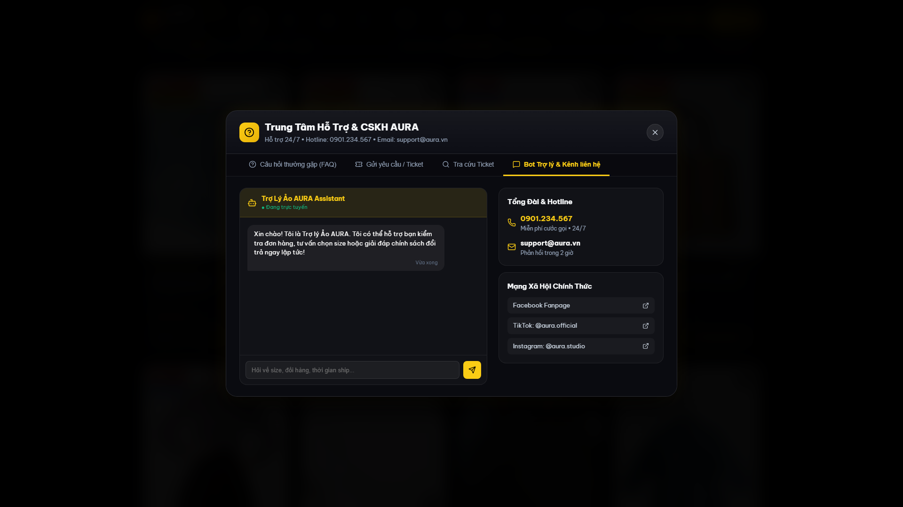

---

#### 10. Modal Đăng Nhập & Đăng Ký Bảo Mật Chuẩn JWT
*Hỗ trợ đăng nhập email/mật khẩu mã hóa Bcrypt, bảo vệ khóa tài khoản khi nhập sai quá 5 lần, tích hợp đăng nhập nhanh qua Google & Facebook OAuth 2.0.*


---

### 👤 PHẦN 2: TRUNG TÂM TÀI KHOẢN CÁ NHÂN (CUSTOMER ACCOUNT PORTAL)

#### 11. Menu Người Dùng Trên Thanh Điều Hướng (Navbar Dropdown)
*Truy cập nhanh vào các phân hệ tài khoản cá nhân, xem trạng thái đăng nhập và vai trò người dùng.*
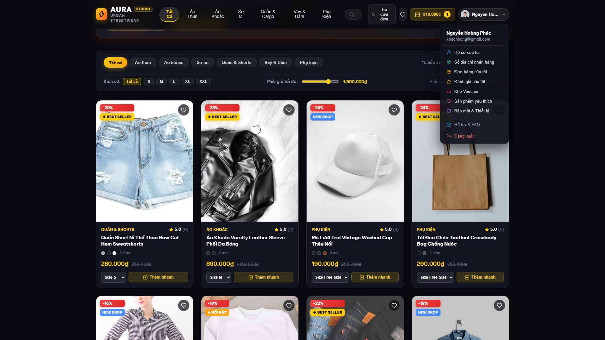

---

#### 12. Hồ Sơ Cá Nhân (Customer Profile)
*Quản lý và cập nhật thông tin cá nhân: Họ và tên, Email, Số điện thoại, Ngày sinh, Giới tính và liên kết ảnh đại diện avatar.*
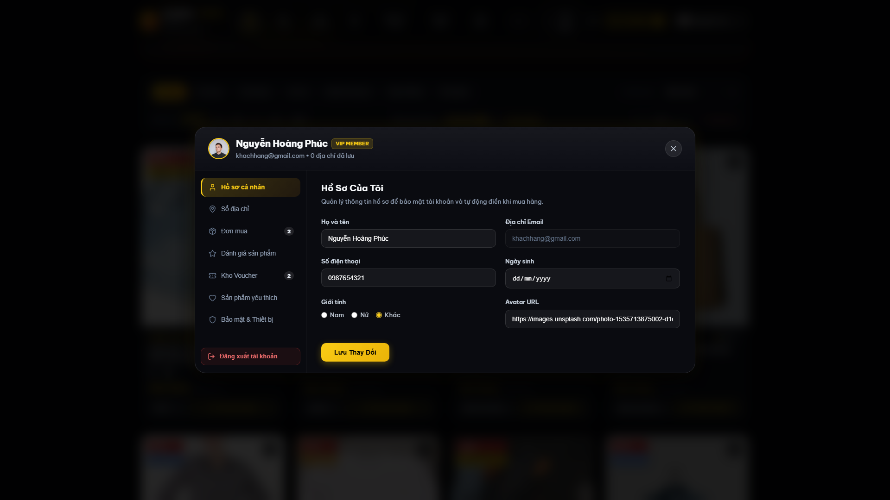

---

#### 13. Sổ Địa Chỉ Nhận Hàng (Address Book)
*Thêm mới, chỉnh sửa, xóa địa chỉ giao hàng và chỉ định một địa chỉ làm **Địa chỉ mặc định** để tự động điền khi thanh toán.*
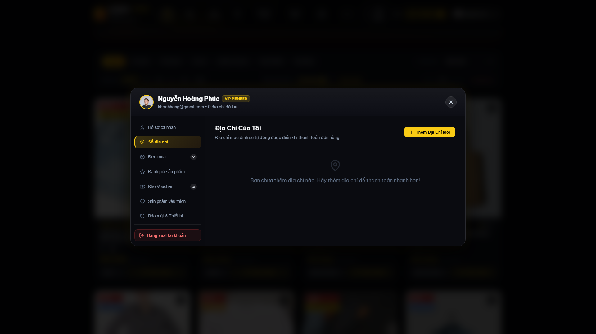

---

#### 14. Quản Lý Đơn Mua Theo 6 Trạng Thái (My Orders)
*Lọc đơn hàng theo từng tab: Tất cả, Chờ xác nhận, Đang xử lý, Đang giao, Đã giao, Đã hủy, Hoàn tiền. Hỗ trợ khách tự hủy đơn hợp lệ khi chưa gửi hàng.*
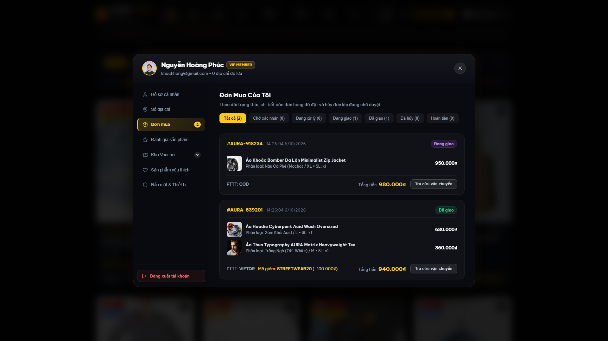

---

#### 15. Đánh Giá Sản Phẩm (Reviews & Ratings)
*Khách hàng chỉ được đánh giá các sản phẩm thuộc đơn hàng **Đã giao thành công**. Cho phép chấm điểm 1-5 sao, nhận xét và tải ảnh phản hồi thực tế.*
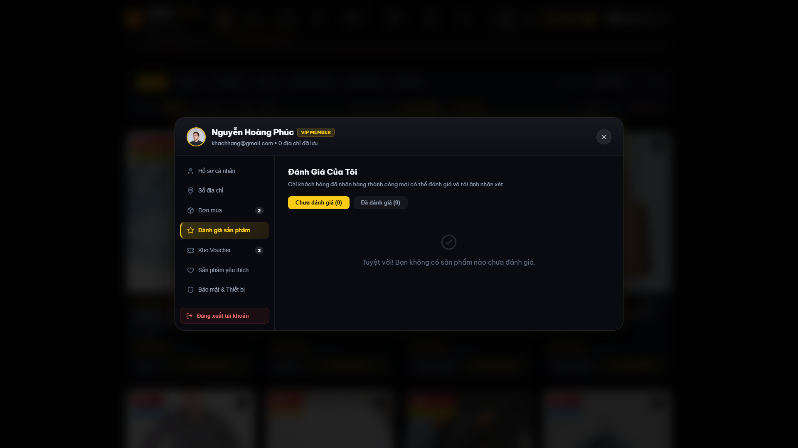

---

#### 16. Kho Voucher Cá Nhân (Voucher Wallet)
*Quản lý danh sách voucher cá nhân theo 3 tab: Voucher khả dụng, Đã dùng, Hết hạn. Nút 1-click sao chép mã coupon nhanh chóng.*
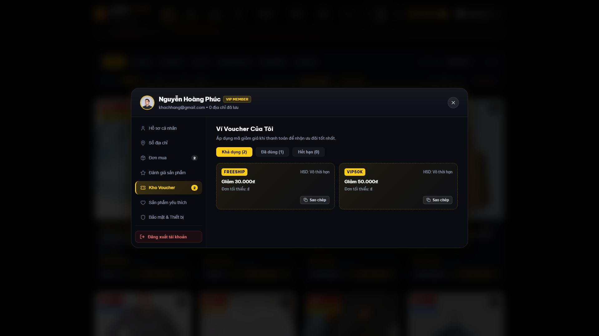

---

#### 17. Trung Tâm Bảo Mật & Quản Lý Thiết Bị Đăng Nhập
*Đổi mật khẩu tài khoản bảo mật, kiểm tra danh sách thiết bị đang đăng nhập và tính năng **Đăng xuất khỏi tất cả thiết bị** vô hiệu hóa token từ xa.*
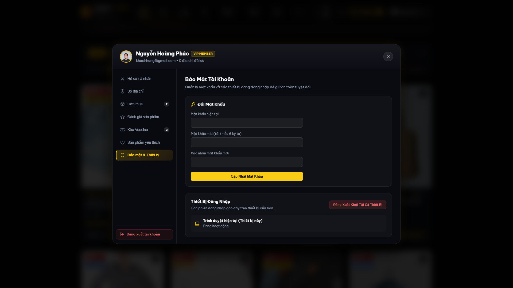

---

### ⚙️ PHẦN 3: HỆ THỐNG QUẢN TRỊ ADMIN CHUYÊN NGHIỆP (`/admin`)

#### 18. Bảng Điều Khiển Tổng Quan (Admin Dashboard & Analytics)
*Báo cáo số liệu kinh doanh: Tổng doanh thu hôm nay, doanh thu tháng, số lượng đơn hàng, người dùng mới, biểu đồ phân tích và danh sách Top sản phẩm.*
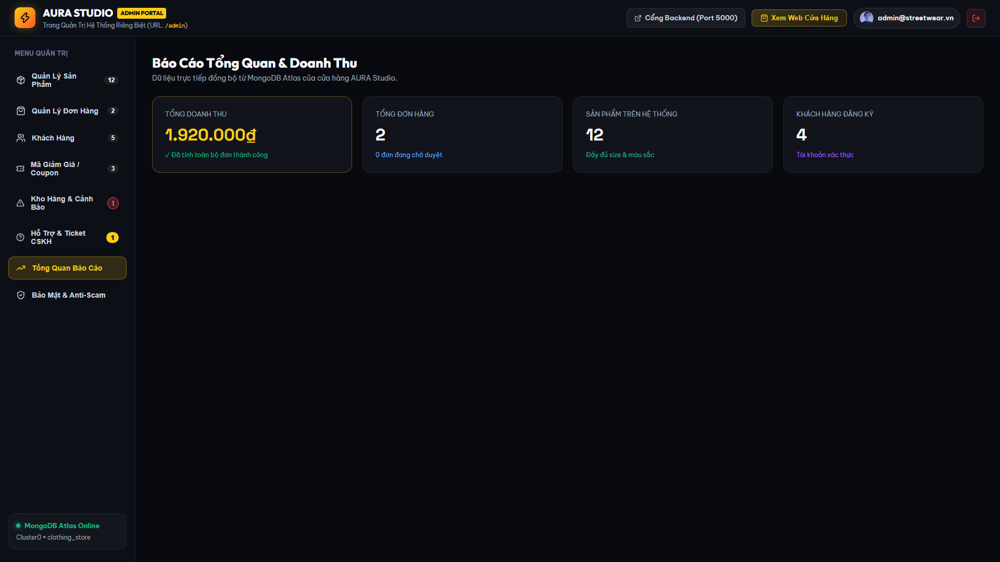

---

#### 19. Quản Trị Danh Mục & Kho Sản Phẩm (Products Management)
*Giao diện bảng dữ liệu trực quan: Xem tồn kho, trạng thái bán, thêm sản phẩm mới kèm tải nhiều ảnh, quản lý các biến thể kích thước và màu sắc.*
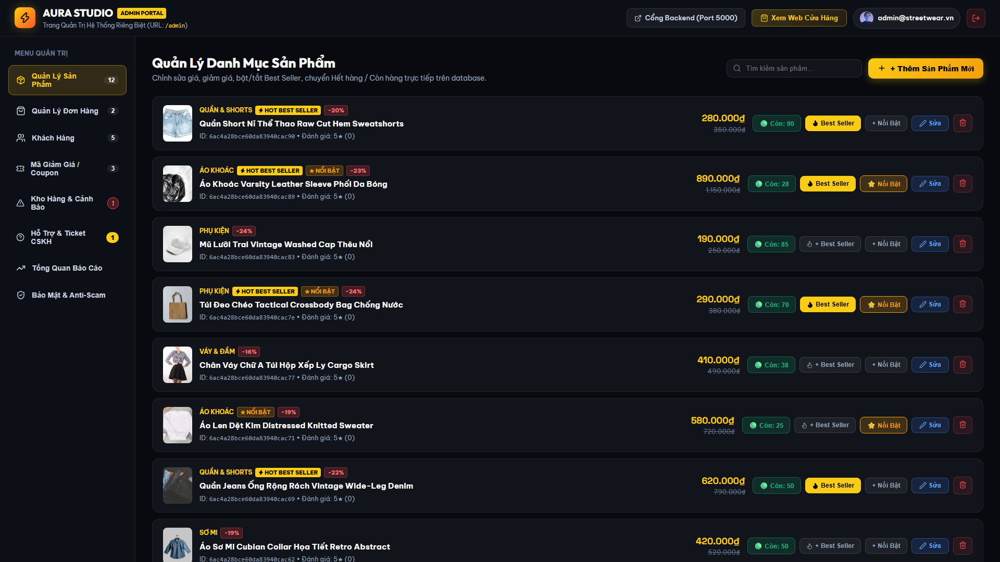

---

#### 20. Quản Lý Đơn Hàng Toàn Diện (Orders Hub)
*Theo dõi danh sách đơn hàng toàn sàn, lọc theo trạng thái, cập nhật tiến độ giao vận, hủy đơn hoặc hoàn tiền kèm cơ chế tự động hoàn lại số lượng tồn kho và hoàn voucher.*
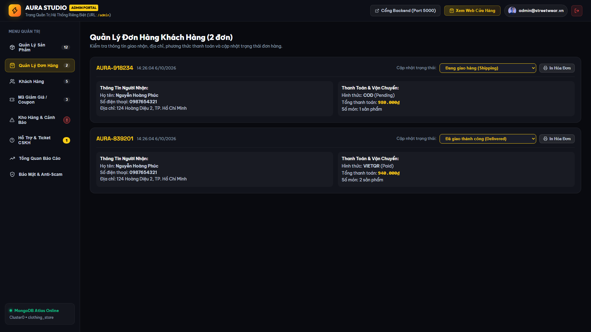

---

#### 21. Modal In Hóa Đơn Điện Tử Bán Hàng (Printable Invoice with QR)
*Mẫu hóa đơn chuyên nghiệp hiển thị đầy đủ thông tin khách hàng, chi tiết đơn giá, mã QR xác thực và nút In / Lưu PDF chuẩn thương mại.*
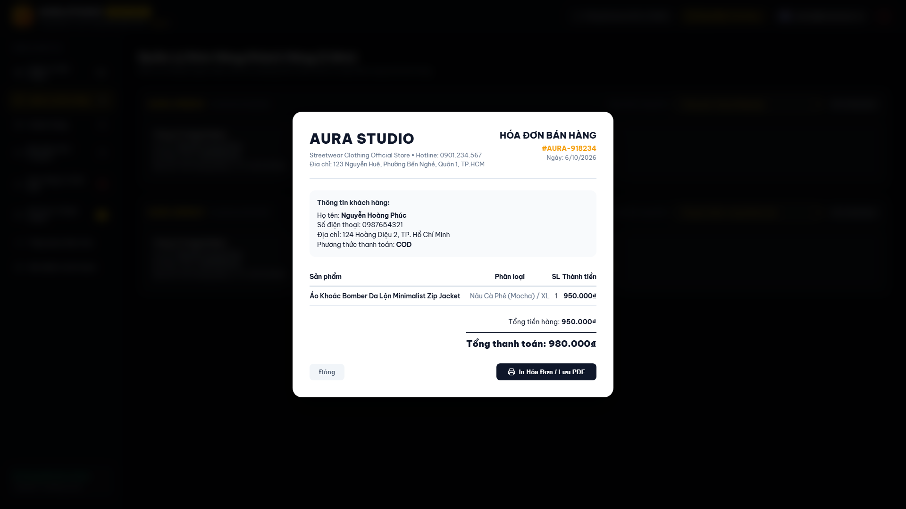

---

## 🌟 Bảng Tổng Hợp Tính Năng Hệ Thống

| Phân hệ | Tính năng nổi bật | Công nghệ / Ghi chú |
| :--- | :--- | :--- |
| **Giao diện Khách hàng** | Dark & Cyberpunk Glassmorphism, Micro-interactions, Confetti ăn mừng | React 19, CSS Modern Tokens |
| **Tìm kiếm & Bộ lọc** | Lọc theo 6 danh mục, 5 size, thanh trượt giá, sắp xếp đa chiều | Client-side & Server query |
| **Giỏ hàng & Đặt hàng** | Drawer trượt, freeship bar, áp dụng mã giảm giá, tự động điền địa chỉ | React Context & LocalStorage |
| **Cổng thanh toán** | COD, MoMo QR/ATM (HMAC-SHA256), VNPay (HMAC-SHA512) | Sandbox API chuẩn bảo mật ngân hàng |
| **Tra cứu đơn hàng** | Timeline vận chuyển 4 bước thời gian thực, mã QR kiểm tra | REST API `/api/orders/track/:code` |
| **Hỗ trợ & Live Chat** | FAQ Accordion, Tạo Ticket `#TK-XXXXXX`, Bot tư vấn AI 24/7 | MongoDB Collection `Ticket` & `FAQ` |
| **Tài khoản cá nhân** | Hồ sơ, Sổ địa chỉ mặc định, Đơn mua 6 trạng thái, Đánh giá có ảnh, Kho voucher, Bảo mật đa thiết bị | JWT Authentication & Token Versioning |
| **Admin Dashboard** | Thống kê doanh thu, biểu đồ phân tích, tỷ lệ chuyển đổi | Aggregation Pipeline MongoDB |
| **Admin Kho & Đơn hàng** | Cập nhật trạng thái đơn, in hóa đơn VAT QR, cảnh báo hết hàng, hoàn voucher/stock khi hủy đơn | Transaction Logic & Mongoose Models |
| **Bảo mật hệ thống** | Ẩn route Admin (404 Cloaking), Rate Limit, Honeypot WAF, Input Sanitization | Express Security Middlewares |

---

## 🔑 Tài Khoản Trải Nghiệm Mẫu

| Tài khoản | Email | Mật khẩu | Quyền hạn |
| :--- | :--- | :--- | :--- |
| **Quản trị viên (Admin)** | `admin@streetwear.vn` | `admin123` | Toàn quyền trang `/admin`, duyệt đơn, quản lý kho, coupon, ticket |
| **Khách hàng (Customer)** | `khachhang@gmail.com` | `user123` | Đã có lịch sử đơn hàng đã giao, đánh giá sản phẩm có ảnh, voucher |
| **Khách hàng (Đã có địa chỉ)** | `khachhang@aura.vn` | `Password123@` | Đã lưu sẵn sổ địa chỉ, trải nghiệm tự động điền form checkout |

---

## 🛠️ Công Nghệ & Thư Viện

- **Frontend**:
  - React 19 (Vite)
  - Vanilla Modern CSS (Design Tokens, Glassmorphism, CSS Grid & Flexbox)
  - Lucide React (Icons)
  - Canvas Confetti
- **Backend**:
  - Node.js & Express.js (RESTful API Architecture)
  - Mongoose & MongoDB Atlas
  - JWT (JSON Web Tokens) & Bcryptjs
  - Crypto (HMAC-SHA256 MoMo, HMAC-SHA512 VNPay)
  - Express Rate Limit & Custom Honeypot WAF

---

## 🚀 Hướng Dẫn Cài Đặt & Khởi Chạy

### 1. Cài đặt các gói thư viện:
```bash
# Cài đặt Backend
cd server
npm install

# Cài đặt Frontend
cd ../client
npm install
```

### 2. Cấu hình file môi trường:
Tạo file `server/.env` dựa theo file `server/.env.example`:
```env
PORT=5000
NODE_ENV=development
MONGODB_URI=mongodb+srv://<username>:<password>@cluster0.bol8qel.mongodb.net/clothing_store?retryWrites=true&w=majority
JWT_SECRET=your_super_secure_jwt_secret_key_at_least_32_characters_long
ADMIN_SECRET_KEY=your_secure_stealth_admin_access_key
CLIENT_URL=http://localhost:3000

# Cổng thanh toán MoMo Sandbox
MOMO_PARTNER_CODE=MOMO
MOMO_ACCESS_KEY=your_momo_access_key
MOMO_SECRET_KEY=your_momo_secret_key
MOMO_API_URL=https://test-payment.momo.vn/gw_payment/transactionProcessor

# Cổng thanh toán VNPay Sandbox
VNPAY_TMN_CODE=your_vnpay_tmn_code
VNPAY_HASH_SECRET=your_vnpay_hash_secret
VNPAY_URL=https://sandbox.vnpayment.vn/paymentv2/vpcpay.html
```

### 3. Khởi chạy hệ thống:

- **Khởi chạy Backend (Port 5000)**:
  ```bash
  cd server
  npm run dev
  ```
- **Khởi chạy Frontend (Port 3000)**:
  ```bash
  cd client
  npm run dev
  ```

### 4. Truy cập hệ thống:
* 🛍️ **Cửa hàng thời trang:** [http://localhost:3000](http://localhost:3000)
* ⚙️ **Trang Quản Trị Hệ Thống (chỉ truy cập được khi đăng nhập tài khoản Admin):** [http://localhost:3000/admin](http://localhost:3000/admin)
* 📚 **API Backend Server:** [http://localhost:5000](http://localhost:5000)

---

## 📄 Bản Quyền & Giấy Phép
Dự án được phát triển phục vụ mục đích học tập và triển khai thực tế hệ thống Thương Mại Điện Tử Thời Trang Chuẩn Doanh Nghiệp.
© 2026 AURA STUDIO. All rights reserved.
